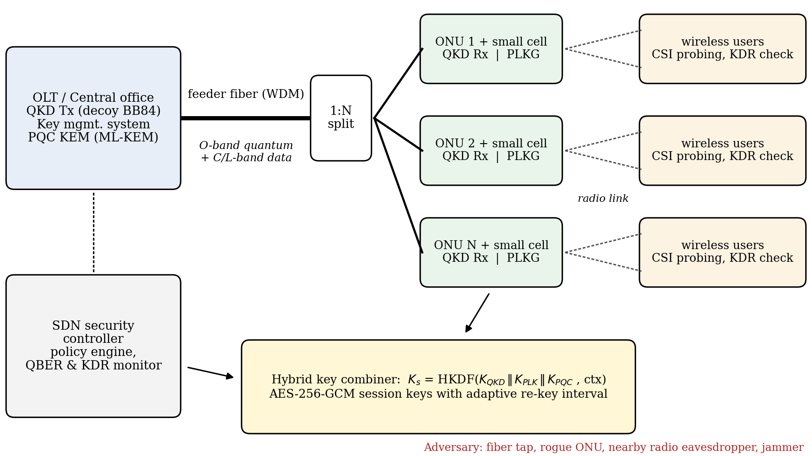

# HQ-KEY: Hybrid Quantum and Physical-Layer Key Management for Fiber–Wireless Access Networks

Simulation code accompanying the paper:

> **HQ-KEY: A Hybrid Quantum and Physical-Layer Key Management Framework for Securing Converged Fiber–Wireless Access Networks.**
> [Author names]. *ICTCS 2026, Springer.*

The code reproduces every numerical result, table value, and figure in Section 5 of the paper.



## What the code does

| Script | Paper section | Description |
|---|---|---|
| `sim_qkd.py` | 4.1, 5.2 | Analytical decoy-state BB84 (vacuum + weak decoy, asymptotic) secret key rate over a PON feeder, including splitter loss and spontaneous Raman noise from co-propagating classical traffic. Also computes QBER under a partial intercept–resend attack. |
| `sim_plkg.py` | 4.2, 5.3 | Monte Carlo simulation (200,000 samples per point, fixed seed) of channel-reciprocity physical-layer key generation over Rayleigh fading with Jakes temporal/spatial correlation, a passive eavesdropper, Gray-coded equiprobable quantization, Gaussian mutual-information leakage, and NIST SP 800-22 monobit/runs/block-frequency tests. |
| `make_figs.py` | 4.3, 5.4 | Generates Figs. 1–4 and the end-to-end key budget (minimum AES-256 re-key interval, Table 3). |
| `run_all.py` | — | Runs the three scripts in order. |

## Quick start

```bash
git clone <this-repository-url>
cd hq-key-simulation
pip install -r requirements.txt
python run_all.py
```

Runtime is about 10 seconds on a laptop. Outputs are written to `results/` (JSON) and `figures/` (PNG, 400 dpi). Pre-computed outputs are already included so results can be inspected without running anything.

## Key results reproduced

| Quantity | Value |
|---|---|
| QKD key rate, 20 km, 1:16 split, no classical traffic | 12.96 kb/s |
| QKD key rate, 20 km, 1:16 split, classical at 10 / 20 dBm | 12.36 / 7.50 kb/s |
| Maximum QKD reach, 1:16 split (none / 10 / 15 / 20 dBm) | 77 / 72 / 60 / 37 km |
| Intercept–resend fraction triggering 11% QBER abort (20 km, 1:16) | 39% |
| PLKG key disagreement rate, 1-bit, at 10 / 20 dB SNR | 13.7% / 4.6% |
| Eavesdropper KDR at 2λ, 20 dB | ≈ 45% |
| PLKG secure key rate per user at 20 / 10 dB (2-bit, 320 samples/s) | 788 / 269 b/s |
| Minimum re-key interval, 32 users/ONU: QKD-only vs. HQ-KEY | 10.9 s vs. 0.33 s (best); 18.0 s vs. 0.95 s (worst) |

## Parameters and assumptions

All physical parameters are defined at the top of each script and listed in Table 2 of the paper. They are **modelling assumptions**, not measurements. In particular:

- The effective Raman coefficient (2×10⁻¹² km⁻¹nm⁻¹, C-band classical → O-band quantum channel) is an assumed value. Raman noise scales with the product ρ·P_c, so a coefficient 10 dB larger is equivalent to shifting Fig. 2(b) by 10 dB in launch power. Raman light is generated in the feeder and attenuated by the splitter and receiver like the quantum signal.
- The QKD key rate is asymptotic (no finite-key corrections).
- PLKG assumes Rayleigh fading with rich scattering; 320 independent samples/s corresponds to 20 temporal samples × 16 decorrelated OFDM sub-bands.
- The PLKG secure-bit estimate subtracts reconciliation leakage (f_EC = 1.16) and the full Gaussian mutual information I(A;E), which is conservative.

To explore other scenarios, edit the parameter dictionary `P` in `sim_qkd.py` or the arguments to `simulate()` in `sim_plkg.py`, then re-run.

## Repository structure

```
hq-key-simulation/
├── sim_qkd.py          # optical layer: decoy-state QKD in a PON
├── sim_plkg.py         # wireless layer: physical-layer key generation
├── make_figs.py        # figures and key budget
├── run_all.py          # reproduce everything
├── requirements.txt
├── results/            # JSON outputs
├── figures/            # Figs. 1-4
├── CITATION.cff
└── LICENSE
```

## Citation

See `CITATION.cff`. Full bibliographic details will be added after publication.

## License

MIT — see `LICENSE`.
